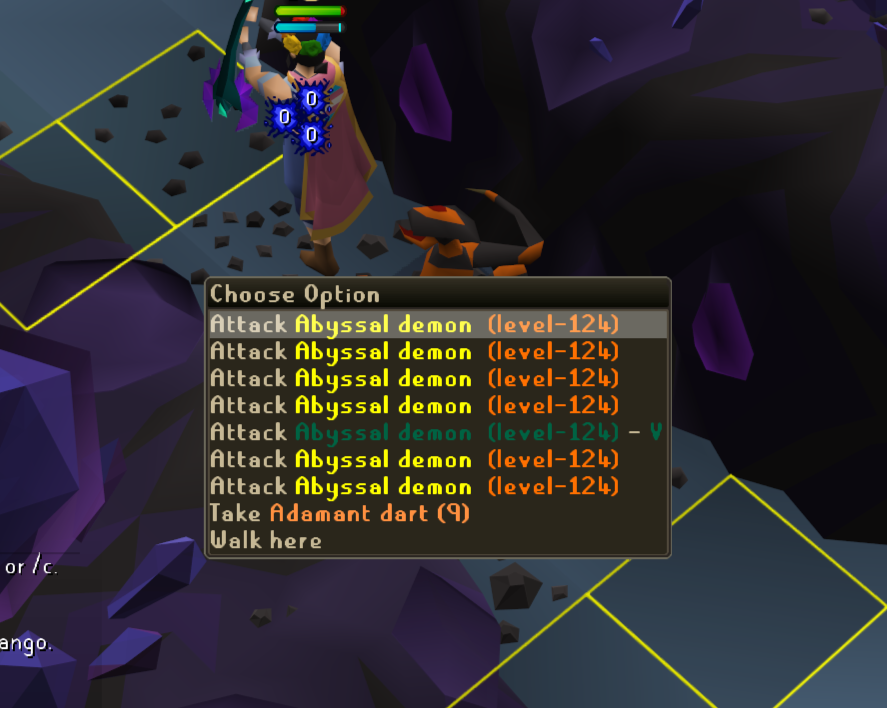
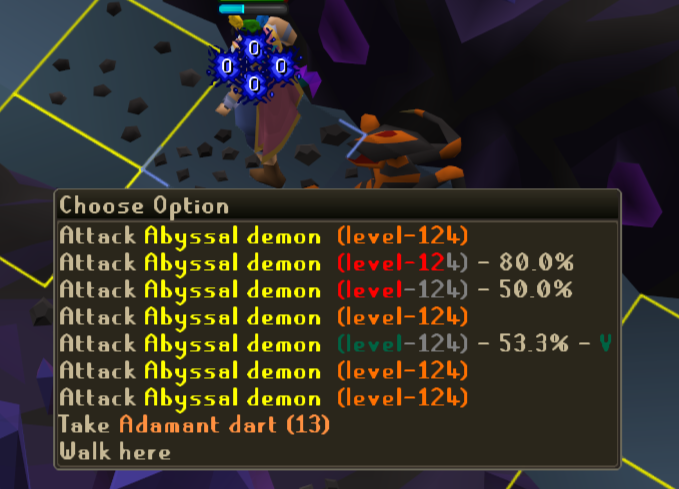

# Venomed NPC Tracker
This plugin keeps track of venomed NPCs and modifies their menu entries to make it easier to differentiate 
between venomed and unvenomed NPCs.

There is an option to integrate this with the Monster Menu HP plugin to show venom status and 
remaining HP at the same time.
If you wish to instead override the Monster Menu HP display colours, it is recommended to set the display mode to "both".

## Features
- Highlights venomed NPCs in the menu via a configurable colour and optional suffix.
- Option to integrate with Monster Menu HP plugin to show venom status alongside HP

## Changelog

### 1.0.0
- Initial release

## Future Plans
- Add highlight options for venomed NPCs outlines
- Add secondary color to indicate NPCs that have been hit but are not yet confirmed as venomed